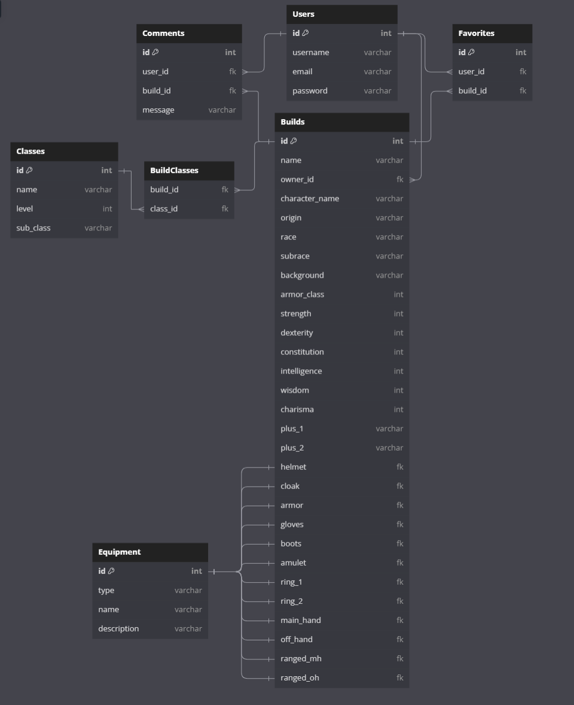

## Database Schema Design



## API Documentation

## USER AUTHENTICATION/AUTHORIZATION

### All endpoints that require authentication

All endpoints that require a current user to be logged in.

- Request: endpoints that require authentication
- Error Response: Require authentication

  - Status Code: 401
  - Headers:
    - Content-Type: application/json
  - Body:

    ```json
    { "errors": { "message": "Unauthorized" } }
    ```

### Authenticate the Current User

Confirms the authentication of the current user.

- Require Authentication: false
- Request

  - Method: GET
  - URL: /api/auth
  - Body: none

- Successful Response when there is a logged in user

  - Status Code: 200
  - Headers:
    - Content-Type: application/json
  - Body:

    ```json
    {
      "id": 1,
      "username": "jsmith",
      "email": "john.smith@gmail.com",
      "username": "JohnSmith"
    }
    ```

- Successful Response when there is no logged in user

  - Status Code: 401
  - Headers:
    - Content-Type: application/json
  - Body:

    ```json
    { "errors": { "message": "Unauthorized" } }
    ```

### Log In a User

Logs in a current user with valid credentials and returns the current user's
information.

- Require Authentication: false
- Request

  - Method: POST
  - URL: /api/auth/login
  - Headers:
    - Content-Type: application/json
  - Body:

    ```json
    {
      "email": "john.smith@gmail.com",
      "password": "password"
    }
    ```

- Successful Response

  - Status Code: 200
  - Headers:
    - Content-Type: application/json
  - Body:

    ```json
    {
      "id": 1,
      "username": "jsmith",
      "email": "john.smith@gmail.com",
      "username": "JohnSmith"
    }
    ```

- Error Response: Invalid credentials

  - Status Code: 401
  - Headers:
    - Content-Type: application/json
  - Body:

    ```json
    {
      "errors": "Invalid credentials"
    }
    ```

- Error response: Body validation errors

  - Status Code: 400
  - Headers:
    - Content-Type: application/json
  - Body:

    ```json

      "errors": {
        "credential": "Email or username is required",
        "password": "Password is required"
      }

    ```

### Sign Up a User

Creates a new user, logs them in as the current user, and returns the current
user's information.

- Require Authentication: false
- Request

  - Method: POST
  - URL: /api/users
  - Headers:
    - Content-Type: application/json
  - Body:

    ```json
    {
      "email": "john.smith@gmail.com",
      "username": "jsmith",
      "password": "secret password"
    }
    ```

- Successful Response

  - Status Code: 200
  - Headers:
    - Content-Type: application/json
  - Body:

    ```json
    {
      "id": 1,
      "username": "jsmith",
      "email": "john.smith@gmail.com",
      "username": "JohnSmith"
    }
    ```

- Error response: User already exists with the specified email

  - Status Code: 500
  - Headers:
    - Content-Type: application/json
  - Body:

    ```json

      "errors": {
        "email": "User with that email already exists"
      }

    ```

- Error response: User already exists with the specified username

  - Status Code: 500
  - Headers:
    - Content-Type: application/json
  - Body:

    ```json

      "errors": {
        "username": "User with that username already exists"
      }

    ```

- Error response: Body validation errors

  - Status Code: 400
  - Headers:
    - Content-Type: application/json
  - Body:

    ```json

      "errors": {
        "email": "Invalid email",
        "username": "Username is required",
        "firstName": "First Name is required",
        "lastName": "Last Name is required"
      }

    ```

## BUILDS

### Get my Builds

Returns all the Builds the logged-in user owns.

- Require Authentication: True
- Request

  - Method: GET
  - URL: /api/builds
  - Body: none

- Successful Response

  - Status Code: 200
  - Headers:
    - Content-Type: application/json
  - Body:

    ```json
    {
      "Builds": [
        {
          "id": 1,
          "owner_id": 1,
          "name": "My First Build",
          "abilities": {
            "build_id": 1,
            "strength": 8,
            "dexterity": 16,
            "constitution": 14,
            "intelligence": 8,
            "wisdom": 12,
            "charisma": 16,
            "plus_1": "Charisma",
            "plus_2": "Dexterity"
          },
          "proficiencies": {
            "stealth": 2,
            "nature": 2,
            "animal_handling": 2
          },
          "character": {
            "build_id": 1,
            "name": "Legolas",
            "origin": "custom",
            "race": "Elf",
            "sub_race": "Wood Elf",
            "background": "Outlander"
          },
          "classes": [
            { "name": "Ranger", "level": 1 },
            { "name": "Ranger", "level": 2 },
            { "name": "Ranger", "level": 3 }
          ],
          "sub_classes": [{ "sub_class": "Gloomstalker" }],
          "spells": [{ "name": "Find Familiar" }],
          "cantrips": [{ "name": "Truestrike" }],
          "effects": [
            {
              "name": "Auntie Ethel's Hair",
              "description": "Agility:1"
            }
          ],
          "feats": [
            {
              "name": "Sharpshooter",
              "description": "Range weapon damage:10"
            }
          ],
          "equipment": {
            "helmet": "helmet_name",
            "cloak": "cloak_name",
            "armor": "armor_name",
            "gloves": "gloves_name",
            "boots": "boots_name",
            "amulet": "amulet_name",
            "ring_1": "ring_1_name",
            "ring_2": "ring_2_name",
            "main_hand": "main_hand_name",
            "off_hand": "off_hand_name",
            "ranged_mh": "ranged_mh_name",
            "ranged_oh": "ranged_oh_name",
            "armor_class": 15
          }
        }
      ]
    }
    ```

### Get details of a Build from an id

Returns the details of a build specified by its id.

- Require Authentication: true
- Request

  - Method: GET
  - URL: /api/builds/:build_id
  - Body: none

- Successful Response

  - Status Code: 200
  - Headers:
    - Content-Type: application/json
  - Body:

    ```json
    {
      "id": 1,
      "owner_id": 1,
      "name": "My First Build",
      "proficiencies": {
        "stealth": 2,
        "nature": 2,
        "animal_handling": 2
      },
      "abilities": {
        "build_id": 1,
        "strength": 8,
        "dexterity": 16,
        "constitution": 14,
        "intelligence": 8,
        "wisdom": 12,
        "charisma": 16,
        "plus_1": "Charisma",
        "plus_2": "Dexterity"
      },
      "character": {
        "build_id": 1,
        "name": "Legolas",
        "origin": "custom",
        "race": "Elf",
        "sub_race": "Wood Elf",
        "background": "Outlander"
      },
      "classes": [
        { "name": "Ranger", "level": 1 },
        { "name": "Ranger", "level": 2 },
        { "name": "Ranger", "level": 3 }
      ],
      "sub_classes": [{ "sub_class": "Gloomstalker" }],
      "spells": [{ "name": "Find Familiar" }],
      "cantrips": [{ "name": "Truestrike" }],
      "effects": [
        {
          "name": "Auntie Ethel's Hair",
          "description": "Agility:1"
        }
      ],
      "feats": [
        {
          "name": "Sharpshooter",
          "description": "Range weapon damage:10"
        }
      ],
      "equipment": {
        "helmet": "helmet_name",
        "cloak": "cloak_name",
        "armor": "armor_name",
        "gloves": "gloves_name",
        "boots": "boots_name",
        "amulet": "amulet_name",
        "ring_1": "ring_1_name",
        "ring_2": "ring_2_name",
        "main_hand": "main_hand_name",
        "off_hand": "off_hand_name",
        "ranged_mh": "ranged_mh_name",
        "ranged_oh": "ranged_oh_name",
        "armor_class": 15
      }
    }
    ```

- Error response: Couldn't find a Server with the specified id

  - Status Code: 404
  - Headers:
    - Content-Type: application/json
  - Body:

    ```json
    {
      "errors": "Build couldn't be found"
    }
    ```

### Create a Build

Creates and returns a new build.

- Require Authentication: true
- Request

  - Method: POST
  - URL: /api/builds
  - Headers:
    - Content-Type: application/json
  - Body:

    ```json
    {
      "owner_id": 1,
      "name": "My Second Build",
      "abilities": {
        "build_id": 1,
        "strength": 8,
        "dexterity": 16,
        "constitution": 14,
        "intelligence": 8,
        "wisdom": 12,
        "charisma": 16,
        "plus_1": "Charisma",
        "plus_2": "Dexterity"
      },
      "proficiencies": {
        "stealth": 2,
        "nature": 2,
        "animal_handling": 2
      },
      "character": {
        "build_id": 1,
        "name": "Legolas",
        "origin": "custom",
        "race": "Elf",
        "sub_race": "Wood Elf",
        "background": "Outlander"
      },
      "classes": [
        { "name": "Ranger", "level": 1 },
        { "name": "Ranger", "level": 2 },
        { "name": "Ranger", "level": 3 }
      ],
      "sub_classes": [{ "sub_class": "Gloomstalker" }],
      "spells": [{ "name": "Find Familiar" }],
      "cantrips": [{ "name": "Truestrike" }],
      "effects": [
        {
          "name": "Auntie Ethel's Hair",
          "description": "Agility:1"
        }
      ],
      "feats": [
        {
          "name": "Sharpshooter",
          "description": "Range weapon damage:10"
        }
      ],
      "equipment": {
        "helmet": "helmet_name",
        "cloak": "cloak_name",
        "armor": "armor_name",
        "gloves": "gloves_name",
        "boots": "boots_name",
        "amulet": "amulet_name",
        "ring_1": "ring_1_name",
        "ring_2": "ring_2_name",
        "main_hand": "main_hand_name",
        "off_hand": "off_hand_name",
        "ranged_mh": "ranged_mh_name",
        "ranged_oh": "ranged_oh_name",
        "armor_class": 15
      }
    }
    ```

- Successful Response

  - Status Code: 201
  - Headers:
    - Content-Type: application/json
  - Body:

    ```json
    {
      "id": 2,
      "owner_id": 1,
      "name": "My Second Build",
      "abilities": {
        "build_id": 1,
        "strength": 8,
        "dexterity": 16,
        "constitution": 14,
        "intelligence": 8,
        "wisdom": 12,
        "charisma": 16,
        "plus_1": "Charisma",
        "plus_2": "Dexterity"
      },
      "proficiencies": {
        "stealth": 2,
        "nature": 2,
        "animal_handling": 2
      },
      "character": {
        "build_id": 1,
        "name": "Legolas",
        "origin": "custom",
        "race": "Elf",
        "sub_race": "Wood Elf",
        "background": "Outlander"
      },
      "classes": [
        { "name": "Ranger", "level": 1 },
        { "name": "Ranger", "level": 2 },
        { "name": "Ranger", "level": 3 }
      ],
      "sub_classes": [{ "sub_class": "Gloomstalker" }],
      "spells": [{ "name": "Find Familiar" }],
      "cantrips": [{ "name": "Truestrike" }],
      "effects": [
        {
          "name": "Auntie Ethel's Hair",
          "description": "Agility:1"
        }
      ],
      "feats": [
        {
          "name": "Sharpshooter",
          "description": "Range weapon damage:10"
        }
      ],
      "equipment": {
        "helmet": "helmet_name",
        "cloak": "cloak_name",
        "armor": "armor_name",
        "gloves": "gloves_name",
        "boots": "boots_name",
        "amulet": "amulet_name",
        "ring_1": "ring_1_name",
        "ring_2": "ring_2_name",
        "main_hand": "main_hand_name",
        "off_hand": "off_hand_name",
        "ranged_mh": "ranged_mh_name",
        "ranged_oh": "ranged_oh_name",
        "armor_class": 15
      }
    }
    ```

- Error Response: Body validation errors

  - Status Code: 400
  - Headers:
    - Content-Type: application/json
  - Body:

    ```json

      "errors": {
        "name": "Name is required"
      }

    ```

### Edit a Build

Updates and returns an existing build.

- Require Authentication: true
- Require proper authorization: Server must belong to the current user
- Request

  - Method: PUT
  - URL: /api/builds/:build_id
  - Headers:
    - Content-Type: application/json
  - Body:

    ```json
    {
      "name": "New Build Name"
    }
    ```

- Successful Response

  - Status Code: 200
  - Headers:
    - Content-Type: application/json
  - Body:

    ```json
    {
      "id": 1,
      "owner_id": 1,
      "name": "New Server Name"
    }
    ```

- Error Response: Body validation errors

  - Status Code: 400
  - Headers:
    - Content-Type: application/json
  - Body:

    ```json

      "errors": {
        "name": "Name is required"
      }

    ```

- Error response: Couldn't find a Server with the specified id

  - Status Code: 404
  - Headers:
    - Content-Type: application/json
  - Body:

    ```json
    {
      "message": "Build couldn't be found"
    }
    ```

### Delete a Build

Deletes an existing build.

- Require Authentication: true
- Require proper authorization: Build must belong to the current user
- Request

  - Method: DELETE
  - URL: /api/build/:build_id
  - Body: none

- Successful Response

  - Status Code: 200
  - Headers:
    - Content-Type: application/json
  - Body:

    ```json
    {
      "message": "Successfully deleted"
    }
    ```

- Error response: Couldn't find a Build with the specified id

  - Status Code: 404
  - Headers:
    - Content-Type: application/json
  - Body:

    ```json
    {
      "error": "Build couldn't be found"
    }
    ```

## ABILITIES

### Create an Ability Table

Creates a new table of abilities for a build.

- Require Authentication: true
- Request

  - Method: POST
  - URL: /api/abilities/:build_id
  - Headers:
    - Content-Type: application/json
  - Body:

    ```json
    {
      "build_id": 1,
      "strength": 8,
      "dexterity": 16,
      "constitution": 14,
      "intelligence": 8,
      "wisdom": 12,
      "charisma": 16,
      "plus_1": "Charisma",
      "plus_2": "Dexterity"
    }
    ```

- Successful Response

  - Status Code: 201
  - Headers:
    - Content-Type: application/json
  - Body:

    ```json
    {
      "message": "Success!"
    }
    ```

- Error Response: Body validation errors

  - Status Code: 400
  - Headers:
    - Content-Type: application/json
  - Body:

    ```json
    {
      "errors": {
        "build_id": "Is required",
        "strength": "Is required",
        "dexterity": "Is required",
        "constitution": "Is required",
        "intelligence": "Is required",
        "wisdom": "Is required",
        "charisma": "Is required",
        "plus_1": "Is required",
        "plus_2": "Is required"
      }
    }
    ```

### Edit an Ability Table

Update and return an existing abilities table.

- Require Authentication: true
- Require proper authorization: Build must belong to the current user
- Request

  - Method: PUT
  - URL: /api/abilities/:build_id
  - Headers:
    - Content-Type: application/json
  - Body:

    ```json
    {
      "build_id": 1,
      "strength": 8,
      "dexterity": 16,
      "constitution": 16,
      "intelligence": 8,
      "wisdom": 12,
      "charisma": 14,
      "plus_1": "Constitution",
      "plus_2": "Dexterity"
    }
    ```

- Successful Response

  - Status Code: 200
  - Headers:
    - Content-Type: application/json
  - Body:

    ```json
    {
      "id": 1,
      "build_id": 1,
      "strength": 8,
      "dexterity": 16,
      "constitution": 16,
      "intelligence": 8,
      "wisdom": 12,
      "charisma": 14,
      "plus_1": "Constitution",
      "plus_2": "Dexterity"
    }
    ```

- Error response: Body validation errors

  - Status Code: 400
  - Headers:
    - Content-Type: application/json
  - Body:

    ```json
    {
      "errors": {
        "build_id": "Is required",
        "strength": "Is required",
        "dexterity": "Is required",
        "constitution": "Is required",
        "intelligence": "Is required",
        "wisdom": "Is required",
        "charisma": "Is required",
        "plus_1": "Is required",
        "plus_2": "Is required"
      }
    }
    ```

- Error response: Couldn't find a Build with the specified id

  - Status Code: 404
  - Headers:
    - Content-Type: application/json
  - Body:

    ```json
    {
      "message": "Build couldn't be found"
    }
    ```

### Delete an Abilities Table

Delete an existing abilities table from a build.

- Require Authentication: true
- Require proper authorization: Build must belong to the current user
- Request

  - Method: DELETE
  - URL: /api/abilities/:build_id
  - Body: none

- Successful Response

  - Status Code: 200
  - Headers:
    - Content-Type: application/json
  - Body:

    ```json
    {
      "message": "Successfully deleted"
    }
    ```

- Error response: Couldn't find a Build with the specified id

  - Status Code: 404
  - Headers:
    - Content-Type: application/json
  - Body:

    ```json
    {
      "message": "Build couldn't be found"
    }
    ```

## PROFICIENCY TABLE

### Create a Proficiencies Table

Creates a new table of proficiencies for a build.

- Require Authentication: true
- Request

  - Method: POST
  - URL: /api/prof/:build_id
  - Headers:
    - Content-Type: application/json
  - Body:

    ```json
    {
      "build_id": 1,
      "stealth": 2,
      "nature": 2,
      "animal_handling": 2
    }
    ```

- Successful Response

  - Status Code: 200
  - Headers:
    - Content-Type: application/json
  - Body:

    ```json
    {
      "id": 1,
      "build_id": 1,
      "stealth": 2,
      "nature": 2,
      "animal_handling": 2
    }
    ```

- Error response: Body validation errors

  - Status Code: 400
  - Headers:
    - Content-Type: application/json
  - Body:

    ```json
    { "errors": "build_id and at least 3 proficiencies required" }
    ```

- Error response: Couldn't find a Build with the specified id

  - Status Code: 404
  - Headers:
    - Content-Type: application/json
  - Body:

    ```json
    {
      "message": "Build couldn't be found"
    }
    ```

### Edit a Proficiency Table

Update and return an existing proficiency table.

- Require Authentication: true
- Require proper authorization: Build must belong to the current user
- Request

  - Method: PUT
  - URL: /api/prof/:build_id
  - Headers:
    - Content-Type: application/json
  - Body:

    ```json
    {
      "build_id": 1,
      "stealth": 2,
      "nature": 2,
      "insight": 2
    }
    ```

- Successful Response

  - Status Code: 200
  - Headers:
    - Content-Type: application/json
  - Body:

    ```json
    {
      "id": 1,
      "build_id": 1,
      "stealth": 2,
      "nature": 2,
      "insight": 2
    }
    ```

- Error response: Body validation errors

  - Status Code: 400
  - Headers:
    - Content-Type: application/json
  - Body:

    ```json
    { "errors": "build_id and at least 3 proficiencies required" }
    ```

- Error response: Couldn't find a Build with the specified id

  - Status Code: 404
  - Headers:
    - Content-Type: application/json
  - Body:

    ```json
    {
      "message": "Build couldn't be found"
    }
    ```

### Delete a Proficiency Table

Delete an existing proficiencies table from a build.

- Require Authentication: true
- Require proper authorization: Build must belong to the current user
- Request

  - Method: DELETE
  - URL: /api/prof/:build_id
  - Body: none

- Successful Response

  - Status Code: 200
  - Headers:
    - Content-Type: application/json
  - Body:

    ```json
    {
      "message": "Successfully deleted"
    }
    ```

- Error response: Couldn't find a Build with the specified id

  - Status Code: 404
  - Headers:
    - Content-Type: application/json
  - Body:

    ```json
    {
      "message": "Build couldn't be found"
    }
    ```

## CHARACTER TABLE

### Create a Character Table

Creates a new character for a build.

- Require Authentication: true
- Request

  - Method: POST
  - URL: /api/character/:build_id
  - Headers:
    - Content-Type: application/json
  - Body:

    ```json
    {
      "build_id": 1,
      "name": "Legolas",
      "origin": "custom",
      "race": "Elf",
      "sub_race": "Wood Elf",
      "background": "Outlander"
    }
    ```

- Successful Response

  - Status Code: 200
  - Headers:
    - Content-Type: application/json
  - Body:

    ```json
    {
      "id": 1,
      "build_id": 1,
      "name": "Legolas",
      "origin": "custom",
      "race": "Elf",
      "sub_race": "Wood Elf",
      "background": "Outlander"
    }
    ```

- Error response: Body validation errors

  - Status Code: 400
  - Headers:
    - Content-Type: application/json
  - Body:

    ```json
    {
      "errors": {
        "build_id": "Is required",
        "name": "Is required",
        "origin": "Is required",
        "race": "Is required",
        "sub_race": "Is required",
        "background": "Is required"
      }
    }
    ```

- Error response: Couldn't find a Build with the specified id

  - Status Code: 404
  - Headers:
    - Content-Type: application/json
  - Body:

    ```json
    {
      "message": "Build couldn't be found"
    }
    ```

### Edit a Character Table

Update and return an existing character table.

- Require Authentication: true
- Require proper authorization: Build must belong to the current user
- Request

  - Method: PUT
  - URL: /api/character/:build_id
  - Headers:
    - Content-Type: application/json
  - Body:

    ```json
    {
      "build_id": 1,
      "name": "Shadowheart",
      "origin": "Shadowheart",
      "race": "Half-Elf",
      "sub_race": "High Half-Elf",
      "background": "Acolyte"
    }
    ```

- Successful Response

  - Status Code: 200
  - Headers:
    - Content-Type: application/json
  - Body:

    ```json
    {
      "id": 1,
      "build_id": 1,
      "name": "Shadowheart",
      "origin": "Shadowheart",
      "race": "Half-Elf",
      "sub_race": "High Half-Elf",
      "background": "Acolyte"
    }
    ```

- Error response: Body validation errors

  - Status Code: 400
  - Headers:
    - Content-Type: application/json
  - Body:

    ```json
    {
      "errors": {
        "build_id": "Is required",
        "name": "Is required",
        "origin": "Is required",
        "race": "Is required",
        "sub_race": "Is required",
        "background": "Is required"
      }
    }
    ```

- Error response: Couldn't find a Build with the specified id

  - Status Code: 404
  - Headers:
    - Content-Type: application/json
  - Body:

    ```json
    {
      "message": "Build couldn't be found"
    }
    ```

### Delete a Proficiency Table

Delete an existing proficiencies table from a build.

- Require Authentication: true
- Require proper authorization: Build must belong to the current user
- Request

  - Method: DELETE
  - URL: /api/prof/:build_id
  - Body: none

- Successful Response

  - Status Code: 200
  - Headers:
    - Content-Type: application/json
  - Body:

    ```json
    {
      "message": "Successfully deleted"
    }
    ```

- Error response: Couldn't find a Build with the specified id

  - Status Code: 404
  - Headers:
    - Content-Type: application/json
  - Body:

    ```json
    {
      "message": "Build couldn't be found"
    }
    ```

## EQUIPMENT TABLE

### Create an Equipment Table

Creates a new equipment for a build.

- Require Authentication: true
- Request

  - Method: POST
  - URL: /api/equipment/:build_id
  - Headers:
    - Content-Type: application/json
  - Body:

    ```json
    {
      "build_id": 1,
      "helmet": "helmet_name",
      "cloak": "cloak_name",
      "armor": "armor_name",
      "gloves": "gloves_name",
      "boots": "boots_name",
      "amulet": "amulet_name",
      "ring_1": "ring_1_name",
      "ring_2": "ring_2_name",
      "main_hand": "main_hand_name",
      "off_hand": "off_hand_name",
      "ranged_mh": "ranged_mh_name",
      "ranged_oh": "ranged_oh_name",
      "armor_class": 15
    }
    ```

- Successful Response

  - Status Code: 200
  - Headers:
    - Content-Type: application/json
  - Body:

    ```json
    {
      "id": 1,
      "build_id": 1,
      "helmet": "helmet_name",
      "cloak": "cloak_name",
      "armor": "armor_name",
      "gloves": "gloves_name",
      "boots": "boots_name",
      "amulet": "amulet_name",
      "ring_1": "ring_1_name",
      "ring_2": "ring_2_name",
      "main_hand": "main_hand_name",
      "off_hand": "off_hand_name",
      "ranged_mh": "ranged_mh_name",
      "ranged_oh": "ranged_oh_name",
      "armor_class": 15
    }
    ```

- Error response: Body validation errors

  - Status Code: 400
  - Headers:
    - Content-Type: application/json
  - Body:

    ```json
    {
      "errors": {
        "helmet": "Is required",
        "cloak": "Is required",
        "armor": "Is required",
        "gloves": "Is required",
        "boots": "Is required",
        "amulet": "Is required",
        "ring_1": "Is required",
        "ring_2": "Is required",
        "main_hand": "Is required",
        "off_hand": "Is required",
        "ranged_mh": "Is required",
        "ranged_oh": "Is required",
        "armor_class": "Is required"
      }
    }
    ```

- Error response: Couldn't find a Build with the specified id

  - Status Code: 404
  - Headers:
    - Content-Type: application/json
  - Body:

    ```json
    {
      "message": "Build couldn't be found"
    }
    ```

### Edit an Equipment Table

Update and return an existing equipment table.

- Require Authentication: true
- Require proper authorization: Build must belong to the current user
- Request

  - Method: PUT
  - URL: /api/equipment/:build_id
  - Headers:
    - Content-Type: application/json
  - Body:

    ```json
    {
      "build_id": 1,
      "helmet": "new_helmet_name",
      "cloak": "new_cloak_name",
      "armor": "new_armor_name",
      "gloves": "new_gloves_name",
      "boots": "new_boots_name",
      "amulet": "new_amulet_name",
      "ring_1": "new_ring_1_name",
      "ring_2": "new_ring_2_name",
      "main_hand": "new_main_hand_name",
      "off_hand": "new_off_hand_name",
      "ranged_mh": "new_ranged_mh_name",
      "ranged_oh": "new_ranged_oh_name",
      "armor_class": 20
    }
    ```

- Successful Response

  - Status Code: 200
  - Headers:
    - Content-Type: application/json
  - Body:

    ```json
    {
      "id": 1,
      "build_id": 1,
      "helmet": "new_helmet_name",
      "cloak": "new_cloak_name",
      "armor": "new_armor_name",
      "gloves": "new_gloves_name",
      "boots": "new_boots_name",
      "amulet": "new_amulet_name",
      "ring_1": "new_ring_1_name",
      "ring_2": "new_ring_2_name",
      "main_hand": "new_main_hand_name",
      "off_hand": "new_off_hand_name",
      "ranged_mh": "new_ranged_mh_name",
      "ranged_oh": "new_ranged_oh_name",
      "armor_class": 20
    }
    ```

- Error response: Body validation errors

  - Status Code: 400
  - Headers:
    - Content-Type: application/json
  - Body:

    ```json
    {
      "errors": {
        "build_id": "Is required",
        "helmet": "Is required",
        "cloak": "Is required",
        "armor": "Is required",
        "gloves": "Is required",
        "boots": "Is required",
        "amulet": "Is required",
        "ring_1": "Is required",
        "ring_2": "Is required",
        "main_hand": "Is required",
        "off_hand": "Is required",
        "ranged_mh": "Is required",
        "ranged_oh": "Is required",
        "armor_class": "Is required"
      }
    }
    ```

- Error response: Couldn't find a Build with the specified id

  - Status Code: 404
  - Headers:
    - Content-Type: application/json
  - Body:

    ```json
    {
      "message": "Build couldn't be found"
    }
    ```

### Delete an Equipment Table

Delete an existing equipment table from a build.

- Require Authentication: true
- Require proper authorization: Build must belong to the current user
- Request

  - Method: DELETE
  - URL: /api/equipment/:build_id
  - Body: none

- Successful Response

  - Status Code: 200
  - Headers:
    - Content-Type: application/json
  - Body:

    ```json
    {
      "message": "Successfully deleted"
    }
    ```

- Error response: Couldn't find a Build with the specified id

  - Status Code: 404
  - Headers:
    - Content-Type: application/json
  - Body:

    ```json
    {
      "message": "Build couldn't be found"
    }
    ```

## CLASS TABLE

### Create a Class Table

Creates a new class for a build.

- Require Authentication: true
- Request

  - Method: POST
  - URL: /api/class/:build_id
  - Headers:
    - Content-Type: application/json
  - Body:

    ```json
    {
      "build_id": 1,
      "name": "Ranger",
      "level": 1
    }
    ```

- Successful Response

  - Status Code: 200
  - Headers:
    - Content-Type: application/json
  - Body:

    ```json
    {
      "id": 1,
      "build_id": 1,
      "name": "Ranger",
      "level": 1
    }
    ```

- Error response: Body validation errors

  - Status Code: 400
  - Headers:
    - Content-Type: application/json
  - Body:

    ```json
    {
      "errors": {
        "build_id": "Is required",
        "name": "Is required",
        "level": "Is required"
      }
    }
    ```

- Error response: Couldn't find a Build with the specified id

  - Status Code: 404
  - Headers:
    - Content-Type: application/json
  - Body:

    ```json
    {
      "message": "Build couldn't be found"
    }
    ```

### Edit a Class Table

Update and return an existing class table.

- Require Authentication: true
- Require proper authorization: Build must belong to the current user
- Request

  - Method: PUT
  - URL: /api/class/:class_id
  - Headers:
    - Content-Type: application/json
  - Body:

    ```json
    {
      "id": 1,
      "build_id": 1,
      "name": "Rogue",
      "level": 1
    }
    ```

- Successful Response

  - Status Code: 200
  - Headers:
    - Content-Type: application/json
  - Body:

    ```json
    {
      "id": 1,
      "build_id": 1,
      "name": "Rogue",
      "level": 1
    }
    ```

- Error response: Body validation errors

  - Status Code: 400
  - Headers:
    - Content-Type: application/json
  - Body:

    ```json
    {
      "errors": {
        "id": "Is required",
        "build_id": "Is required",
        "name": "Is required",
        "level": "Is required"
      }
    }
    ```

- Error response: Couldn't find a Class with the specified id

  - Status Code: 404
  - Headers:
    - Content-Type: application/json
  - Body:

    ```json
    {
      "message": "Class couldn't be found"
    }
    ```

### Delete a Class Table

Delete an existing class table from by id.

- Require Authentication: true
- Require proper authorization: Build must belong to the current user
- Request

  - Method: DELETE
  - URL: /api/class/:class_id
  - Body: none

- Successful Response

  - Status Code: 200
  - Headers:
    - Content-Type: application/json
  - Body:

    ```json
    {
      "message": "Successfully deleted"
    }
    ```

- Error response: Couldn't find a Class with the specified id

  - Status Code: 404
  - Headers:
    - Content-Type: application/json
  - Body:

    ```json
    {
      "message": "Class couldn't be found"
    }
    ```

## Subclasses, Spells, Cantrips, Permanent Effects, and Feats still to come...
